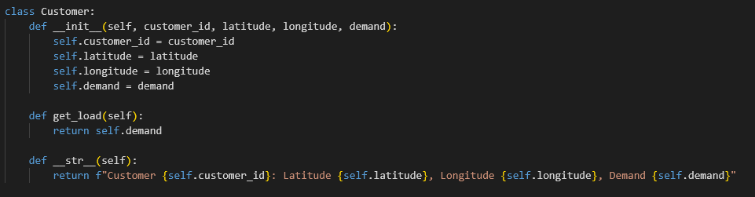
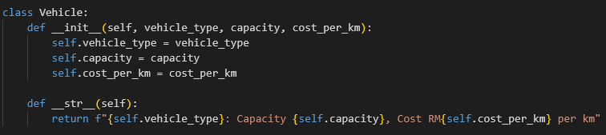
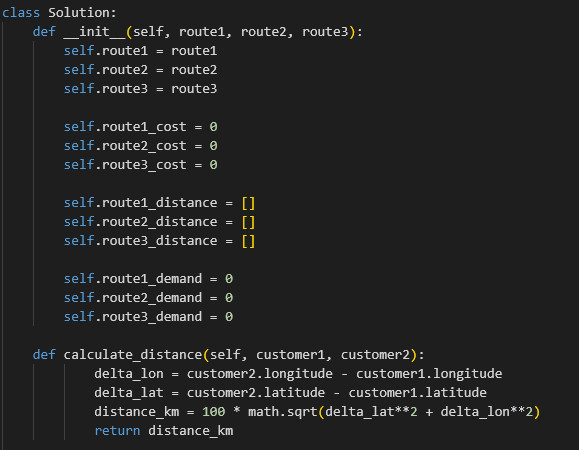
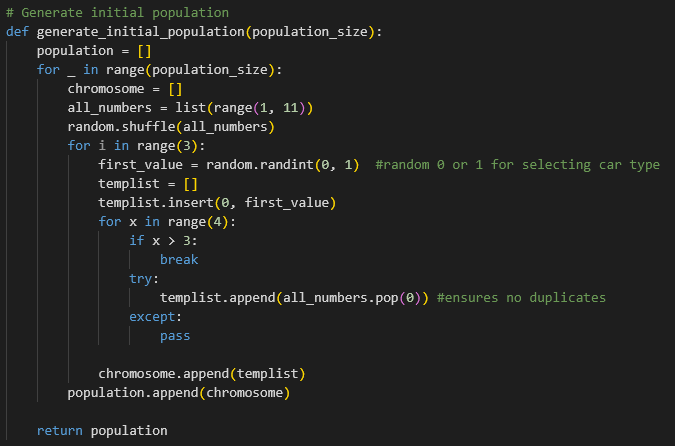
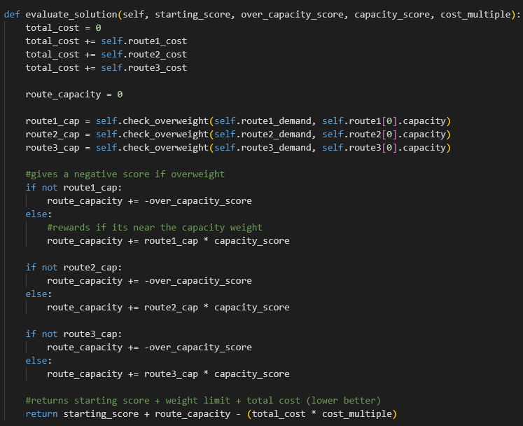
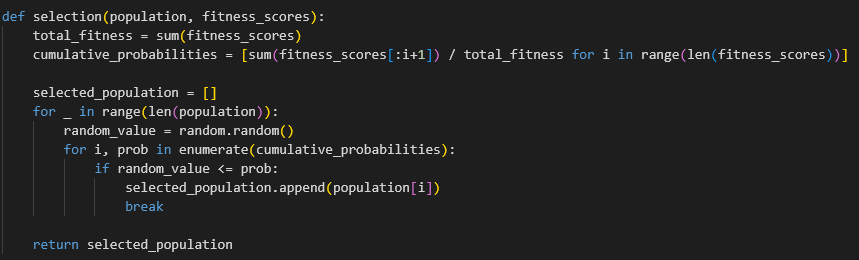
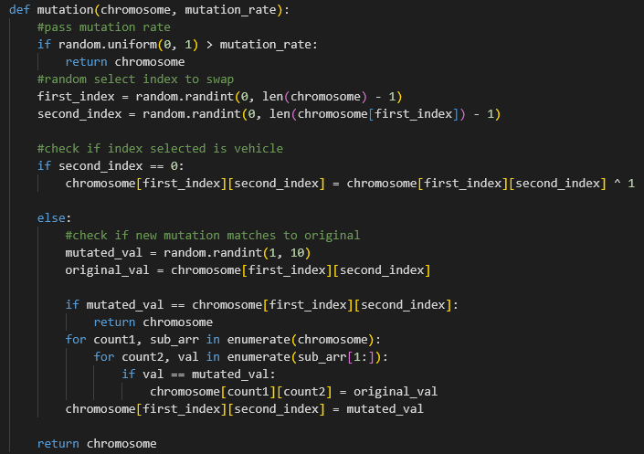
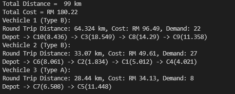

# Mode Fair Software Developer (AI) Technical Assessment
This repository is a Technical Assessment for Mode Fair Software Developer (AI)

## Overview
1. assessment.py
    - Technical assesment contents were completed here
2. images
    - images of code snipets

## Approach

1. Class Implementation 
    - Customer
        - Represents a customer with attributes such as customer ID, latitude, longitude, and demand.
    
    

    
    
    

    - Vehicle 
        - Represents a vehicle with attributes like vehicle type, capacity, and cost per kilometer.

    

    
    

    - Solution
        - Represents a solution consisting of three routes (route1, route2, route3).
        - Calculates distances, costs, and loads for each route.
        - Evaluates the solution based on predefined scores for distance, capacity, and cost.

    

    
    

2. Genetic Algorithm Components
    - Initialization
        - Generates an initial population of solutions with random chromosome values.
        - Each chromosome represents a combination of vehicle types and customer orders.

    

    
    

    - Fitness Calculation
        - Calculates the fitness of each solution based on distance, capacity, and cost.
        - Evaluates each solution using a fitness function that combines these factors.

    

    
    

    - Selection
        - Selects individuals from the population based on their fitness scores.
        - Higher fitness individuals have a higher chance of being selected.

    

    
    

    - Crossover and Mutation
        - Applies order crossover to selected individuals to create new offspring.
        - Incorporates mutation to introduce genetic diversity and explore new solutions.

    

    
    

    

    
    

    - Rule Checking
        - Ensures that chromosomes adhere to defined rules such as no duplicate customers and valid vehicle types.

    

    
    

    - Example Output

    

    
    

